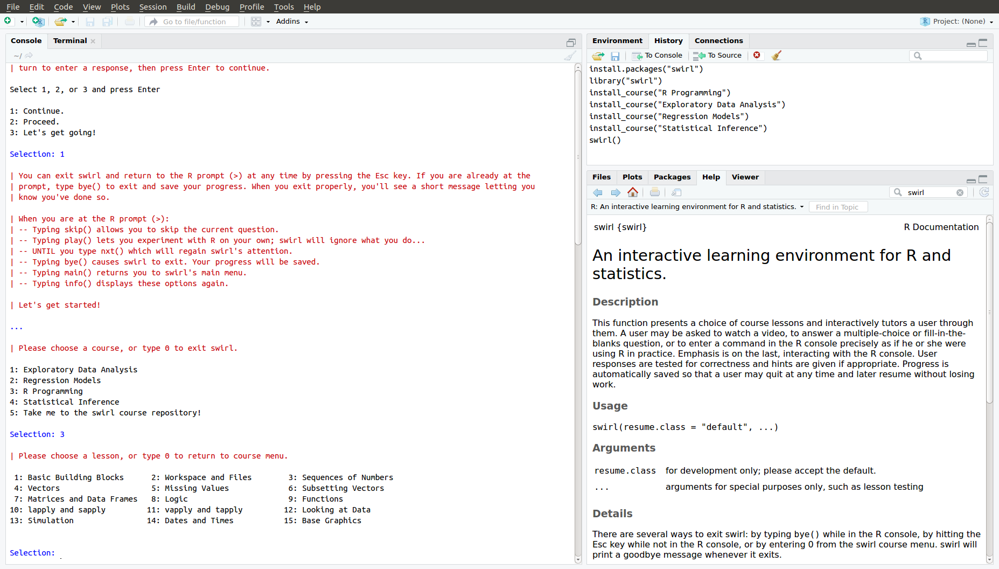

**Forked from [swirl courses](https://github.com/swirldev/swirl_courses)**
## NICF- Statistics Bootcamp Workshops & References


**This [Statistics Bootcamp (SB)](https://www.iss.nus.edu.sg/executive-education/course/detail/nicf-statistics-bootcamp/analytics-and-intelligent-systems "Statistics Bootcamp") course is part of the Analytics and Intelligent Systems and Graduate Certificate in [Business Analytics Practice](https://www.iss.nus.edu.sg/stackable-certificate-programmes/business-analytics/graduate-certificate-in-business-analytics-practice "Business Analytics Practice") series offered by [NUS-ISS](https://www.iss.nus.edu.sg "Institute of Systems Science, National University of Singapore").**

**Co-Lecturer: [GU Zhan (Sam)](https://www.iss.nus.edu.sg/about-us/staff/detail/201/GU%20Zhan "GU Zhan (Sam)")**


**zhan.gu@nus.edu.sg**


## Interactive R Workshops/Courses
This is a collection of interactive courses for use with the [swirl R package](http://swirlstats.com). You'll find instructions for installing courses further down on this page. Some courses are still in development and we'd love to hear any [suggestions](https://github.com/swirldev/swirl_courses/issues/new) you have as you work through them.

For more information regarding swirl, visit [swirlstats.com](http://swirlstats.com) or the [swirl GitHub repository](https://github.com/swirldev/swirl). If you'd like to write your own interactive content, please visit the [Instructors page](http://swirlstats.com/instructors.html) of our website.

Here are our current offerings, organized by level of difficulty:

#### Fundamental

- **R Programming**: The basics of programming in R
- **Exploratory Data Analysis**: Statistics and Data visualization in R

#### Intermediate

- **Open Intro**: A review to statistics, data analysis, and data visualization `Additional workshop`
- **Mathematical Biostatistics Boot Camp**: One- and two-sample t-tests, power, and sample size `Additional workshop` 
- **Regression Models**: The basics of regression modeling in R

#### Advanced

- **Statistical Inference**: This intermediate to advanced level course closely follows the
[Statistical Inference course](https://www.coursera.org/course/statinference) of the Johns Hopkins 
[Data Science Specialization](https://www.coursera.org/specialization/jhudatascience/1) on Coursera. It
introduces the student to basic concepts of statistical inference
including probability, hypothesis testing, confidence intervals and
p-values. It concludes with an initiation to topics of particular
relevance to big data, issues of multiple testing and resampling.
- **Getting and Cleaning Data**: dplyr, tidyr, lubridate, hardcore time consuming data pre-processing `Additional workshop`

Since our users come from a variety backgrounds, it's very hard to label material as **Fundamental**, **Intermediate**, or **Advanced**. If you find something that is labelled **Fundamental** to be challenging, please don't be discouraged. The first step of learning anything is to acknowledge that you are capable of understanding it. True understanding will come with time and practice.


## Workshop Video Guides


- **Install R workshops**

 [](https://youtu.be/QP2bVF1JB0Q "Install R workshops")
 
---

- **[Fundamental] R Programming**

 **R Programming** 1: Basic Building Blocks
 
 [](https://youtu.be/g7fihJ2Vm6M "**R Programming** 1: Basic Building Blocks")
 
 **R Programming** 2: Workspace and Files
 
 [](https://youtu.be/jfn8mtn9tEo "**R Programming** 2: Workspace and Files")
 
 **R Programming** 3: Sequences of Numbers
 
 [](https://youtu.be/h6VP8S_GQlo "**R Programming** 3: Sequences of Numbers")
 
 **R Programming** 4: Vectors
 
 [](https://youtu.be/7cJzYWn_8Ok "**R Programming** 4: Vectors")
 
 **R Programming** 5: Missing Values
 
 [](https://youtu.be/rAsJMas4ybA "**R Programming** 5: Missing Values")
 
 **R Programming** 6: Subsetting Vectors
 
 [](https://youtu.be/PYe3jgwfpeo "**R Programming** 6: Subsetting Vectors")
 
 **R Programming** 7: Matrices and Data Frames
 
 [](https://youtu.be/Wow8gDy-p4g "**R Programming** 7: Matrices and Data Frames")
 
 **R Programming** 8: Logic 
 
 [](https://youtu.be/lw10u8nd2cA "**R Programming** 8: Logic ")
 
 **R Programming** 9: Functions
 
 [](https://youtu.be/ "**R Programming** 9: Functions")
 
 **R Programming** 10: lapply and sapply 
 
 [](https://youtu.be/rXkgbFb8uAY "**R Programming** 10: lapply and sapply ")
 
 **R Programming** 11: vapply and tapply
 
 [](https://youtu.be/ "**R Programming** 11: vapply and tapply")
 
 **R Programming** 12: Looking at Data
 
 [](https://youtu.be/yC3wLKcrfGY "**R Programming** 12: Looking at Data")
 
 **R Programming** 13: Simulation
 
 [](https://youtu.be/wwj5Rax5qwo "**R Programming** 13: Simulation")
 
 **R Programming** 14: Dates and Times
 
 [](https://youtu.be/ "**R Programming** 14: Dates and Times")
 
 **R Programming** 15: Base Graphics 
 
 [](https://youtu.be/yzKSKvUMCZU "**R Programming** 15: Base Graphics")
 
---

- **[Fundamental] Exploratory Data Analysis**

 **Exploratory Data Analysis** 1: Principles of Analytic Graphs
 
 [](https://youtu.be/ "")
 
 **Exploratory Data Analysis** 2: Exploratory Graphs
 
 [](https://youtu.be/p5QmyVnokdw "**Exploratory Data Analysis** 2: Exploratory Graphs")
 
 **Exploratory Data Analysis** 3: Graphics Devices in R `[PDF PNG SVG]` 
 
 [](https://youtu.be/ "")
 
 **Exploratory Data Analysis** 4: Plotting Systems
 
 [](https://youtu.be/kaM7_raCRTg "**Exploratory Data Analysis** 4: Plotting Systems")
 
 **Exploratory Data Analysis** 5: Base Plotting System
 
 [](https://youtu.be/9S9z5D8uS74 "**Exploratory Data Analysis** 5: Base Plotting System")
 
 **Exploratory Data Analysis** 6: Lattice Plotting System
 
 [](https://youtu.be/ "")
 
 **Exploratory Data Analysis** 7: Working with Colors 
 
 [](https://youtu.be/ "")
 
 **Exploratory Data Analysis** 8: GGPlot2 Part1 `[qplot]` 
 
 [](https://youtu.be/yZd876Z5a30 "**Exploratory Data Analysis** 8: GGPlot2 Part1")
 
 **Exploratory Data Analysis** 9: GGPlot2 Part2 `[ggplot]` 
 
 [](https://youtu.be/MjPuzTvLmy4 "**Exploratory Data Analysis** 9: GGPlot2 Part2")
 
 **Exploratory Data Analysis** 10: GGPlot2 Extras `[qplot]` 
 
 [](https://youtu.be/ "")
 
 **Exploratory Data Analysis** 11: Hierarchical Clustering `[Machine Learning]`
 
 [](https://youtu.be/ "")
 
 **Exploratory Data Analysis** 12: K Means Clustering `[Machine Learning]`
 
 [](https://youtu.be/ "")
 
 **Exploratory Data Analysis** 13: Dimension Reduction `[Machine Learning]`
 
 [](https://youtu.be/ "")
 
 **Exploratory Data Analysis** 14: Clustering Example `[Machine Learning]`
 
 [](https://youtu.be/ "")
 
 **Exploratory Data Analysis** 15: CaseStudy `[pm2.5 air pollution]` 
 
 [](https://youtu.be/ "")
 
---

- **[Intermediate] Open Intro** 

 **Open Intro** 1: Overview of Statistics 

---

- **[Intermediate] Mathematical Biostatistics Boot Camp** 

 **Mathematical Biostatistics Boot Camp** 1: One Sample t-test `[nitty-gritty]` 
 
 **Mathematical Biostatistics Boot Camp** 2: Two Sample t-test `[nitty-gritty]` 
 
 **Mathematical Biostatistics Boot Camp** 3: Errors Power and Sample Size 

---

- **[Intermediate] Regression Models** 

 **Regression Models** 1: Introduction `[regression to mean]`
 
 **Regression Models** 2: Residuals `[var(data)=var(estmt)+var(resdls)]`
 
 **Regression Models** 3: Least Squares Estimation 
 
 **Regression Models** 4: Residual Variation `[R^2=1-sRes/sTot=cor()^2]`
 
 **Regression Models** 5: Introduction to Multivariable Regression 
 
 **Regression Models** 6: MultiVar Examples 
 
 **Regression Models** 7: MultiVar Examples2 
 
 **Regression Models** 8: MultiVar Examples3 `[MultipleLinearRegression]`
 
 **Regression Models** 9: Residuals Diagnostics and Variation 
 
 **Regression Models** 10: Variance Inflation Factors `[VIF]` 
 
 **Regression Models** 11: Overfitting and Underfitting `[ANOVA, F-test]`
 
 **Regression Models** 12: Binary Outcomes 
 
 **Regression Models** 13: Count Outcomes 

---

- **[Advanced] Statistical Inference**

 **Statistical Inference** 1: Introduction
 
 [](https://youtu.be/qYfbkommx1k "**Statistical Inference** 1: Introduction")
 
 **Statistical Inference** 2: Probability1 `[dice, playing cards]`
 
 [](https://youtu.be/ "")
 
 **Statistical Inference** 3: Probability2 `[PMF PDF CDF]`
 
 [](https://youtu.be/ "")
 
 **Statistical Inference** 4: ConditionalProbability `[medic test]`
 
 [](https://youtu.be/ "")
 
 **Statistical Inference** 5: Expectations `[E(X), CLT]` 
 
 [](https://youtu.be/NnJY8yOndkY "**Statistical Inference** 5: Expectations")
 
 **Statistical Inference** 6: Variance `[Var E(X^2)-(E(X))^2]`
 
 [](https://youtu.be/ "")
 
 **Statistical Inference** 7: CommonDistros `[Bernoulli Normal Poisson]`
 
 [](https://youtu.be/ "")
 
 **Statistical Inference** 8: Asymptotics `[central limit theorem, CI]` 
 
 [](https://youtu.be/ "")
 
 **Statistical Inference** 9: T Confidence Intervals `[nitty-gritty]`
 
 [](https://youtu.be/ "")
 
 **Statistical Inference** 10: Hypothesis Testing `[t-test, z score]` 
 
 [](https://youtu.be/SJ-fJuyeV2I "**Statistical Inference** 10: Hypothesis Testing")
 
 **Statistical Inference** 11: P Values `[nitty-gritty]` 
 
 [](https://youtu.be/vcOZg5wqDpY "**Statistical Inference** 11: P Values")
 
 **Statistical Inference** 12: Power `[false negative, Type II error]`
 
 [](https://youtu.be/ "")
 
 **Statistical Inference** 13: Multiple Testing `[confusion matrix]`
 
 [](https://youtu.be/ "")
 
 **Statistical Inference** 14: Resampling `[bootstrap]`
 
 [](https://youtu.be/ "")
 

---

- **[Advanced] Getting and Cleaning Data** 

 **Getting and Cleaning Data** 1: Manipulating Data with dplyr

 **Getting and Cleaning Data** 2: Grouping and Chaining with dplyr

 **Getting and Cleaning Data** 3: Tidying Data with tidyr

 **Getting and Cleaning Data** 4: Dates and Times with lubridate

---

## Install and run a workshop/course automatically

It automates the process by allowing you to do everything right from the R console.



1) Make sure you have a recent version version of swirl:

```
install.packages("swirl")
```

2) Enter the following from the R console to install:

```
library("swirl")
install_course("R Programming")
install_course("Exploratory Data Analysis")
install_course("Regression Models")
install_course("Statistical Inference")
swirl()
```

For example, `install_course("R Programming")` will install the R Programming course. **Please note that course names are case sensitive!**


## Install and run additional workshop/course manually

If the automatic course installation method outlined above does not work for you, then there's a simple alternative.

1) Click [**here**](https://github.com/telescopeuser/S-SB-Workshop/archive/master.zip "S-SB-Workshop-master.zip") to download the file `S-SB-Workshop-master.zip`.

2) Install all all available courses:

```
library("swirl")
install_course_zip("~/Downloads/S-SB-Workshop-master.zip", multi=TRUE)
swirl()
```

---

Or, to install one course at a time, enter the following from the R console, **substituting the correct file path** to your downloaded file and the **name of your desired course**:

```
install_course_zip("path/to/file/here/S-SB-Workshop-master.zip", multi=TRUE, 
                   which_course="Course Name Here")
```

For example, if you download the zip file to `~/Downloads/S-SB-Workshop-master.zip`, then the following command will install the R Programming course.

```
install_course_zip("~/Downloads/S-SB-Workshop-master.zip", multi=TRUE, which_course="R Programming")
```

**Please note that course names are case sensitive!**


## Uninstall a course

If you'd like to remove a course at any time, you can use `uninstall_course("Course Name Here")`.
If you'd like to remove all courses at any time, you can use `uninstall_all_courses(force = FALSE)`.

## Delete a user's progress

If you'd like to delete a user's workshop progress, you can use `delete_progress("User Name Here")`.

## Using swirl in the classroom

Instructors around the world are using swirl in their classrooms. We think this is awesome. If you're an instructor, please feel free to do the same -- free of charge. While your students may be paying to take your course or attend your institution, we simply ask that you don't charge people *directly* for the use of our software or instructional content.

If you are not sure about a particular use case, don't hesitate to send us an email at info@swirlstats.com.

---

**Data Science Wars: R versus Python:**

https://www.datasciencecentral.com/profiles/blogs/data-science-wars-r-versus-python

---

**Data Science Road Map created by Swami Chandrasekaran:**

http://nirvacana.com/thoughts/wp-content/uploads/2018/01/RoadToDataScientist1.png


